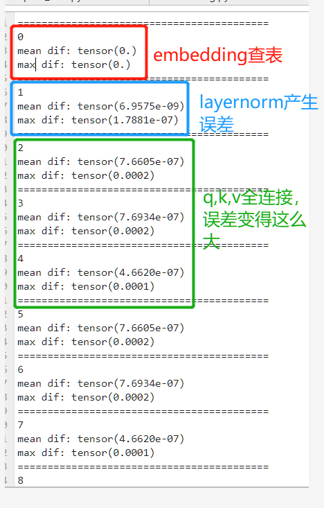

# 问题：
GPU环境下。paddle.nn.Linear与torch.nn.Linear误差太大（也就是paddle.matmul与torch.matmul无法对齐）。
存在误差的输出如果后面接了个`nn.Linear`或`paddle.matmul`误差会突然变得很大！！

<p align="center">
    
</p>

例子1：(这个是我在检查错误的过程中保存的中间变量及对应的权重，详情请进入`example.ipynb`运行查看结果)
```python
# 加载我保存的变量，确保都在GPU环境下。
torch_weight,torch_bias = torch.load("pt_x.pt")
paddle_weight,paddle_bias = paddle.load("pd_x.pd")
torch_inputs = torch.load("weights.pt")
paddle_inputs = paddle.load("weights.pd")
# 比较weight权重 误差为0
compare(torch_weight,paddle_weight.t()) 
# 比较bias 误差为0
compare(torch_bias,paddle_bias)
# 比较输入 误差为0
compare(torch_inputs,paddle_inputs)
# 进行matmul计算
shuchu1 = torch.matmul(torch_inputs,torch_weight.cuda().t()) + torch_bias.cuda()
shuchu2 = paddle.matmul(paddle_inputs,paddle_weight) + paddle_bias
compare(shuchu1,shuchu2)
# 平均误差 tensor(4.2843e-06)
# 最大误差 tensor(3.6240e-05)
```

例子2：（当使用随机初始化，正态分布0,0.02初始化时，误差正常）
```python
# 误差存在,达到10-8级别，还算正常。
import paddle
import torch
import numpy as np

# 正态分布0,0.02
pd_linear_weight = paddle.normal(0,0.02,(768,768))
pd_linear_bias = paddle.normal(0,0.02,(768,))

# 我也定义了类似torch.nn.Linear并使用paddle权重进行初始化
pt_linear_weight = torch.tensor(pd_linear_weight.t().numpy()).cuda()
pt_linear_bias = torch.tensor(pd_linear_bias.numpy()).cuda()

# 初始化输入
# 正态分布0,0.02
pd_inputs = paddle.normal(0,0.02,(32,768)) 
pt_inputs = torch.tensor(pd_inputs.numpy()).cuda()

o1 = paddle.matmul(pd_inputs,pd_linear_weight,transpose_y=True) + pd_linear_bias
o2 = torch.matmul(pt_inputs,pt_linear_weight)  + pt_linear_bias
o1 = o1.numpy()
o2 = o2.cpu().numpy()

print("amax ",np.abs(o1-o2).max())
print("amean ",np.abs(o1-o2).mean())
print(np.all(np.isclose(o1,o2 , atol=0, rtol=1.e-6)))
# amax  2.2351742e-08
# amean  3.6701877e-09
# False
```

例子3：（当使用随机初始化，标准正态分布0,1初始化时，方差很大，误差达到10-5级别，这个结果看起来与例子1有点类似）

```python
# 误差存在,达到10-5级别，误差太大了。
import paddle
import torch
import numpy as np

# 正态分布0,0.02
pd_linear_weight = paddle.normal(0,1,(768,768))
pd_linear_bias = paddle.normal(0,1,(768,))

# 我也定义了类似torch.nn.Linear并使用paddle权重进行初始化
pt_linear_weight = torch.tensor(pd_linear_weight.t().numpy()).cuda()
pt_linear_bias = torch.tensor(pd_linear_bias.numpy()).cuda()

# 初始化输入
# 正态分布0,0.02
pd_inputs = paddle.normal(0,1,(32,768)) 
pt_inputs = torch.tensor(pd_inputs.numpy()).cuda()

o1 = paddle.matmul(pd_inputs,pd_linear_weight,transpose_y=True) + pd_linear_bias
o2 = torch.matmul(pt_inputs,pt_linear_weight)  + pt_linear_bias
o1 = o1.numpy()
o2 = o2.cpu().numpy()

print("amax ",np.abs(o1-o2).max())
print("amean ",np.abs(o1-o2).mean())
print(np.all(np.isclose(o1,o2 , atol=0, rtol=1.e-6)))
# amax  5.722046e-05
# amean  9.370713e-06
# False
```

结论：
- 在输入的方差较小的情况下（这个也就是之前我所说使用随机初始化的时候精度基本能对齐），paddle.matmul与torch.matmul精度对齐效果还算可以。但理论上不应该存在误差。
- 在输入的方差较大的情况下（这个也就是我加载了预训练权重，精度对齐时候最大误差很大，因为你无法使得你的输入和你的权重方差都很小！！！），paddle.matmul与torch.matmul精度对齐效果太差，误差实在太大！


# 当前的解决方法，在paddle代码中，使用pytorch的基础算子替换原有产生误差的基础算子(这里只改变了基础算子的计算，并未改变其他代码，因此原来写的代码是正确的，误差的主要来源就是来自框架之间基础算子的不对齐！)。

- (1) 使用同种layer norm计算方法，消除layer norm产生的误差。
- (2) 使用torch.matmul代替paddle.matmul消除nn.Linear计算时产生的误差。
- (3) paddle.sum 替换成 torch.sum
- (4) paddle代码中_len_and_dim_norm计算方式替换成 pytorch中的计算方式
- (5) paddle代码中torchlogsumexp计算方式替换成pytorch中的计算方式

```python

def torchlayernorm(x,weight,bias):
    x = torch.tensor(x.cpu().numpy()).cuda()
    weight = torch.tensor(weight.clone().cpu().numpy()).cuda()
    bias = torch.tensor(bias.clone().cpu().numpy()).cuda()
    u = x.mean(-1, keepdim=True)
    s = (x - u).pow(2).mean(-1, keepdim=True)
    x = (x - u) / torch.sqrt(s + 1e-12)
    out = weight * x + bias
    return paddle.to_tensor(out.cpu().numpy())

def torchdense(x,weight,bias=None):
    x = torch.tensor(x.cpu().numpy()).cuda()
    weight = torch.tensor(weight.clone().cpu().numpy()).cuda()
    if bias is not None:
        bias = torch.tensor(bias.clone().cpu().numpy()).cuda()
        out = torch.matmul(x,weight) + bias
    else:
        out = torch.matmul(x,weight)
    return paddle.to_tensor(out.cpu().numpy())

def _len_and_dim_norm(vectors,attention_head_size):
    """
    length and attention head size dim normalization
    """
    vectors = torch.tensor(vectors.cpu().numpy()).cuda()
    vectors = _len_norm(vectors)
    vectors = vectors * torch.rsqrt(
        torch.tensor(attention_head_size, device=vectors.device, dtype=vectors.dtype)
    )
    return paddle.to_tensor(vectors.cpu().numpy())

def _len_norm(x, epsilon=1e-6):
    """
    length normalization
    """
    variance = torch.mean(x ** 2, -1, keepdim=True)
    norm_x = x * torch.rsqrt(variance + epsilon)
    return norm_x

def torchlogsumexp(query_key_dots, axis=-1, keepdim=True):
    x = torch.tensor(query_key_dots.cpu().numpy()).cuda()
    out = torch.logsumexp(x, dim=axis, keepdim=keepdim)
    return paddle.to_tensor(out.cpu().numpy())


def torchsum(x,axis):
    x = torch.tensor(x.cpu().numpy()).cuda()
    out = torch.sum(x,dim=axis)
    return paddle.to_tensor(out.cpu().numpy())    
```

# 替换好基础算子后，可以进行比较，最终误差为0
- （1）准备预训练权重！
paddle版本  https://huggingface.co/junnyu/reformer_paddle/tree/main/reformer-enwik8
huggingface版本 https://huggingface.co/google/reformer-enwik8/tree/main
- （2）进行比较 `python compare_eval.py`
- （3）查看输出：`weights/12_layer.txt`
- （4）发现误差都为0.

```python
compare hidden_states
mean dif:  tensor(0.)
max dif:  tensor(0.)
**************************************************
mean dif:  tensor(0.)
max dif:  tensor(0.)
**************************************************
mean dif:  tensor(0.)
max dif:  tensor(0.)
**************************************************
mean dif:  tensor(0.)
max dif:  tensor(0.)
**************************************************
mean dif:  tensor(0.)
max dif:  tensor(0.)
**************************************************
mean dif:  tensor(0.)
max dif:  tensor(0.)
**************************************************
mean dif:  tensor(0.)
max dif:  tensor(0.)
**************************************************
mean dif:  tensor(0.)
max dif:  tensor(0.)
**************************************************
mean dif:  tensor(0.)
max dif:  tensor(0.)
**************************************************
mean dif:  tensor(0.)
max dif:  tensor(0.)
**************************************************
mean dif:  tensor(0.)
max dif:  tensor(0.)
**************************************************
mean dif:  tensor(0.)
max dif:  tensor(0.)
**************************************************
mean dif:  tensor(0.)
max dif:  tensor(0.)
**************************************************
297
**************************************************
```

注意：
- 由于我的模型输入是shape=[2, 1024],1024要被chunk，会需要产生`一个随机random_rotations`，为了进行对齐，因此我实现产生了相同的`buck.pd`和`buck.pt`以便加载。
- 如果输入是shape=[2, 32],32是不需要被chunk，因此也不需要产生`一个随机random_rotations`。